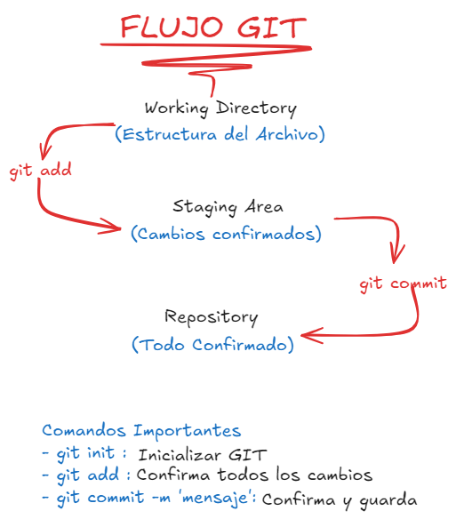
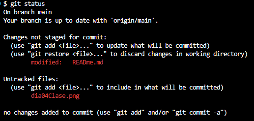
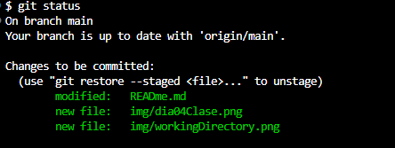
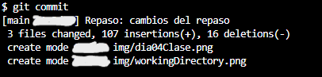

# 

## COMANDOS Y CONFIGURACION GIT

0. Configuracion de GIT en nuestro Sistema Operativo (**git config -- global user.name && user.email**)

1. _git init_ : Inicializa git en nuestros proyectos (solo se ejecuta una vez)

2. _git status_ : Te menciona la situacion de tu proceso de GIT

3. _git add ._ : Pasa cambios de **Working Directory** a **Staging Area**

4. _git commit -m "Mi primer commit"_ : Pase cambios de **Stading Area** a **Repository**

5. _git log: : Te muestra todos los commit

6. _git log --oneline_ : Muestra los commit en una liena

### Flujo GIT

---

### Working Directory

...

### Staging Area

...

### Repository

---

### .gitignore

- Un archivo local **.gitignore** generalmente se coloca en el directorio raíz de un proyecto.
- También puedes crear un archivo global **.gitignore**, y cualquier entrada en ese archivo se ignorará en todos tus repositorios de Git.

- Para crear un archivo **.gitignore** local, crea un archivo de texto y asígnale el nombre "**.gitignore**" (recuerda incluir el . al principio).
- Luego, edita este archivo según sea necesario.
- Cada nueva línea debe incluir un archivo o carpeta adicional que quieras que _Git lo ignore_.

---

### BRANCHS (ramas)

1. _Main_ (**Produccion**) : El ambiente para los clientes

2. _Desarrollo_ (**Dev**) : Nuestro ambiente para trabajar

3. _QA_ (**Calidad de Codigo**) : Se prueban los desrrollos

4. _UAT_ (**Pre Producion**) : Antes de mandar a produccion

 >
 >Integracion (QA es uno mismo) => Hasta el dia Jueves(x) (Metodologia Screm)
 >
 >1:(Desarrollo) => 2:(QA) => 3:(UTA) => 4:(Producion)
 >

- **Cada empresa tiene sus propios lineamientos**

---

## GITHUB

 > GitHub es una plataforma de desarrollo colaborativo basada en la web que utiliza Git, un sistema de control de versiones.
 >
 > Permite a los desarrolladores gestionar proyectos de software, colaborar con otros, y llevar un seguimiento de los cambios en el código.
 >
 > Con características como repositorios, pull requests, issues y wikis, GitHub facilita la colaboración y la gestión de proyectos.

 ...

### Comandos más usados en GitHub:

1. _git init_ : Inicializa un nuevo repositorio local.

2. _git clone [url]_ : Clona un repositorio remoto a tu máquina local.

3. _git add [archivo]_ : Añade cambios al área de preparación (staging).

4. _git commit -m "mensaje"_ : Guarda los cambios en el repositorio con un mensaje descriptivo.

5. _git push_ : Sube los cambios locales al repositorio remoto.

6. _git pull_ : Trae y fusiona cambios del repositorio remoto a tu rama actual.

7. _git branch_ : Muestra las ramas existentes en el repositorio.

8. _git checkout [rama]_ : Cambia a otra rama.

9. _git merge [rama]_ : Fusiona otra rama en la rama actual.

10. _git status_ : Muestra el estado de los cambios en el repositorio.

Estos comandos son esenciales para interactuar con repositorios en GitHub y facilitar el flujo de trabajo colaborativo en proyectos de software.

---
